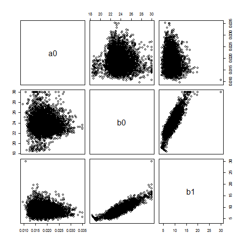

# Part 1: Continuous distributions

## Uniform

The uniform is used when there's an equal probability of an event occurring over a range of values.

(plots have been omitted for this trivial distribution)

### Questions

**Q 1:** Why does the height of the uniform PDF change as the width changes?

**A:** Normalization of PDFs requires that $H*W=1$ or $H=\frac{1}{W}$.

**Q 2:** What do the second and third arguments to the uniform specify? What are their default values?

**A:** Minimum and maximum values in the domain. Zero and one are the defaults.


## Beta

The Beta is an interesting distribution because it is bound on the range 0 <= X <= 1 and thus is very often used to describe data that is a proportion.  At first glance the mathematical formula for the Beta looks a lot like the Binomial:

$$Beta(x \mid a,b) \propto x^{a-1} (1-x)^{b-1}$$
$$Binom(x \mid n,p) \propto p^x (1-p)^{n-p}$$

The critical difference between the two is that in the Beta the random variable X is in the base while in the Binomial it is in the exponent.  Unlike many distributions you may be have used in the past, the two shape parameters in the Beta do not define the mean and variance, but these can be calculated as simple functions of a and ß.  The Beta does have an interesting property of symmetry though, whereby Beta(a,ß) is the reflection of Beta(ß,a).


```r
p = seq(0,1,by=0.01)
plot(p,dbeta(p,5,5),type='l')
lines(p,dbeta(p,1,1),col=2)
lines(p,dbeta(p,0.2,0.2),col=3)
```

 

```r
plot(p,dbeta(p,6,6),type='l',ylim=c(0,5))
lines(p,dbeta(p,6,4),col=2)
lines(p,dbeta(p,6,2),col=3)
lines(p,dbeta(p,6,1.25),col=4)
lines(p,dbeta(p,6,1),col=5)
lines(p,dbeta(p,6,0.25),col=6)
```

 

### Questions

**Q 3:** The Beta has a special case, Beta(1,1) that is equivalent to what other PDF?

**A:** Uniform.

**Q 4:** In the first panel, the mean is the same for each line (0.5).  What are the variances? (Hint: you need to calculate this analytically. Look up the distribution in one of the recommended references.)

**A:** 


```r
sigma_beta <- function(a,b){
  return(a*b/(a+b)^2/(a+b+1))
}
```


$a$          | $b$    | $\sigma^2 = \frac{ab}{(a+b)^2(a+b+1)}$
------------ | ------ | ----------
5            | 5      | 0.0227 
1            | 1      | 0.0833 
0.2          | 0.2    | 0.1786 

**Q 5:** In the second panel, what are the means and medians of each of these curves?  (Hint: you'll need to calculate the mean analytically and use one of the variants of R's beta function to find the median.)

**A:**

```r
mu_beta <- function(a,b){
  return(a/(a+b))
}
median_beta <- function(a,b){
  # 50th percential x value
  return(qbeta(0.5,a,b))
}
```


$a$          | $b$    | $\mu = \frac{a}{(a+b)}$  | $\tilde{x} = qnorm(p=0.5, a, b)$
------------ | ------ | ------------------------ | -------------------
6            | 6      | 0.5         | 0.5
6            | 4      | 0.6         | 0.6069
6            | 2      | 0.75         | 0.7715
6            | 1.25   | 0.8276      | 0.858
6            | 1      | 0.8571         | 0.8909
6            | 0.25   | 0.96      | 0.9923

## Log Normal

The lognormal is a log transform of the normal distribution.  It is defined on the range X > 0 so is commonly used for data that cannot be negative by definition.  The distribution is also positively skewed so is often used for skewed data.  One thing that often goes unappreciated with the log-normal is that the mean, E[X], depends on the variance:

$$E[X] = e^{\mu + {{1}\over{2}}\sigma^2}$$

This applies not just when you explicitly use the lognormal, but also **whenever you log-transform data** and then calculate a mean or standard deviation – a fact that is vastly under-appreciated in the biological and environmental sciences and frequently missed in the published literature.  In fact, ANY data transformation applied to make data “more normal” will change the mean, with the functional form of the bias depending on the transformation used.  You can not simply back-transform the data without correcting for this bias.  This phenomena is another illustration of Jensen's Inequality.


```r
## changing the mean
x <- 10^seq(-2,2,by=0.01)
plot(x,dlnorm(x,0),type='l',xlim=c(0,15),main="Changing the Mean")
lines(x,dlnorm(x,1),col=2)
lines(x,dlnorm(x,2),col=3)
```

 

### Questions
**Q 6:** What are the arithmetric and geometric means of the three curves in the first panel? (Reminder: arithmetic means are means in the linear domain, geometric means are means in the log domain)

```r
mean_dlnorm<- function(mu){
  # Arithmetic mean
  x <- 10^seq(-2,2,by=0.01)
  return(weighted.mean(x,w = dlnorm(x,mu)))
}

gm_mean_dlnorm <- function(mu){
  # geometric mean of a log-normal distribution follows:
  # log(geom_mean) = mu where mu parameterizes the underlying normal.
  # geom_mean(y) = exp(mu) where log(y) = x; (x being normal)
  return(exp(mu))
}
```

Distrubition | Arithmetic Mean    | Geometric Mean
------------ | ------------------ | ----------
rlnorm(x,0)  | 0.6066 | 1
rlnorm(x,1)  | 1.6485 | 2.7183
rlnorm(x,2)  | 4.4625 | 7.3891

## Exponential & Laplace

The exponential distribution arises naturally as the time it takes for an event to occur when the average rate of occurrence, *r*, is constant.  The exponential is a special case of the Gamma (discussed next) where $Exp(X \mid r) = Gamma(X \mid 1,r)$.  The exponential is also a special case of the Weibull, $Exp(X \min r) = Weibull(X \mid r,1)$, where the Weibull is a generalization of the exponential that allows the rate paraemter *r* to increase or decrease with time.  The Laplace is basically a two-sided exponential and arises naturally if one is dealing with absolute deviation, $\left|x-m\right|$, rather than squared deviation, $(x-m)^2$, as is done with the normal.


```r
x <- seq(0,10,by=0.01)
## laplace vs Gaussian
plot(x,dexp(abs(x-5),1)/2,type='l')
lines(x,dnorm(x,5),col=2)
```

 

```r
plot(x,dexp(abs(x-5),1)/2,type='l',log='y')   ## same plot as last but on a log scale
lines(x,dnorm(x,5),col=2)
```

 

### Questions

**Q 7:** The two panels above compare a normal and a Laplace distribution with the same mean and variance.  How do the two compare?  In particular, compare the difference in the probabilities of extreme events in each distribution.

**A:** From the plots we can see more weight in the tail of the Laplace distribution than in the normal. Likewise for the central peak there is more weight in the Laplace distribution than in the normal.

## Gamma

The gamma and inverse-gamma distribution are flexible distributions defined for positive real numbers.  These are frequently used to model the distribution of variances or precisions (precision = 1/variance), in which case the shape and rate parameters are related to the sample size and sum of squares, respectively.  The gamma is frequently used in Bayesian statistics as a prior distribution, and also in mixture distributions for inflating the variance of another distribution

# Part 2: Discrete distributions

## Binomial

The binomial arises naturally from counts of the number of successes given a probability of success, p, and a sample size, n.  You are probably already familiar with the binomial in the context of coin toss examples.

### Questions
**Q 10:**  Consider a binomial distribution that has a constant mean, np.  What are the differences in the shape of this distribution if it has a high n and low p vs. a low n and high p?

```r
x = 25:125
x_bar = 75
n = seq(100,500,by=100)
p = x_bar/n
plot(x, dbinom(x,size=n[1], prob=p[1]), type='l', xlim=c(0,150), ylim=c(0,0.2))  
for(i in 2:length(n)){
  lines(x, dbinom(x,size=n[i], prob=p[i]), type='s', col=i)  
}
legend(5, 0.2, paste("n =", n,"p =", p),
                  lty=c(1,1),
                  lwd=c(2.5,2.5),col=c("black",2:5))
```

 

**A:** As $p$ decreases ($n$ increases) the distribution becomes wider.

## Poisson

The Poisson is also very common for count data and arises as the number of events that occur in a fixed amount of time (e.g. number of bird sightings per hour), or the number of items found in a fixed amount of space (e.g. the number of trees in a plot). Unlike the Binomial distribution the Poisson doesn't have a fixed upper bound for the number of events that can occur.


```r
x <- 20:80
plot(x,dpois(x,50),type='s',ylim=c(0,0.08))     #Poisson with mean 50 (variance = 50)
lines(x+0.5,dnorm(x,50,sqrt(50)),col=2)     #Normal with mean and variance of 50
lines(x,dbinom(x,100,0.5),col=3,type='s')       #Binomial with mean 50 (variance = 25)
legend("topright",legend=c("pois","norm","binom"),col=1:3,lty=1)
```

 

```r
plot(x,dbinom(x,100,0.5),type='s',col=3)        #Binomial with mean 50 (variance = 25)
lines(x+0.5,dnorm(x,50,sqrt(25)),col=2)     #Normal with mean 50 and variance of 25
lines(x,dpois(x,50),col=1,type='s')         #Poisson with mean 50 (variance = 50)
legend("topright",legend=c("pois","norm","binom"),col=1:3,lty=1)
```

 

### Questions:
**Q 11:**  Normal distributions are often applied to count data even though count data can only take on positive integer values.  Is this fair is this to do in these two examples? (i.e. how good is the normal approximation).

**A:** Provided the sample size is large, the normal can be used to very closely approximate the Poisson or Binomial distributions given an appropriate choice of variance. In otherwords, the Poisson and Binomial distributions are normal under large sample sizes.

**Q 12:** Would the normal be a fair approximation to the Poisson curves for small numbers (next panel)? How about for the Bionomial for small numbers?


```r
x <- 0:12
plot(x,dpois(x,1),type='s')
lines(x,dpois(x,2),type='s',col=2)
lines(x,dpois(x,5),type='s',col=3)
```

 

**A:** The Poisson curves for small $\lambda$ are too skew to be represented accurately with a normal distribution. The Binomial distribution *can* be symmetric for small samples (provided p=0.5), however they are also extremely discrete and are likely poorly apporximated by a normal especially for sample sizes under 10.

**Q 13:** Is the Poisson a good approximation of the Binomial?

**A:** For large $n$ but not for small $n$.

**Q 14:** Is it possible to choose the parameters so that the Poisson and Binomial to both have the same mean and  variance?  If so what is this parameterization?

**A:** The Poisson distribution has a variance equal to its mean (both $\lambda$). The Binomial has a mean of $np$. Setting the two equal yields: $\lambda = np$ which is true in the limit $n$ is large.

## Negative binomial

The negative Binomial has two interesting interpretations that are subtlety different from either the Poisson or Binomial.  In the first case, it is the number of trials needed in order to observe a fixed number of occurrences, which is the opposite from the Binomial's number of occurrences in a fixed trial size and thus where it gets its name.  The Negative Binomial also arises as the distribution of number of events that occur in a fixed space or time when the rate is not constant (as in the Poisson) but varies according to a Gamma distribution.  Hence the Negative Binomial is also used to describe data that logically seems to come from a Poisson process but has greater variability that is expected from the Poisson (which by definition has a variance equal to its mean).  The Geometric distribution arises as a special case of the negative binomial where the number of occurrences is fixed at 1.


```r
x <- 0:20
## negative binomial

## vary size
plot(x,dnbinom(x,1,0.5),type="s",main="vary size")
lines(x,dnbinom(x,2,0.5),type="s",col=2)
lines(x,dnbinom(x,3,0.5),type="s",col=3)
lines(x,dnbinom(x,5,0.5),type="s",col=4)
lines(x,dnbinom(x,10,0.5),type="s",col=5)
legend("topright",legend=c(1,2,3,5,10),col=1:5,lty=1)
```

 

```r
## vary variance , alternate parameterization
mean = 8
var = c(10,20,30)
size = mean^2/(var-mean)
plot(x,dnbinom(x,mu=mean,size=size[1]),type="s",ylim=c(0,0.14),main="vary variance")
lines(x,dnbinom(x,mu=mean,size=size[2]),type="s",col=2)
lines(x,dnbinom(x,mu=mean,size=size[3]),type="s",col=3)
legend('topright',legend=format(c(var,mean),digits=2),col=1:4,lty=1)
lines(x,dpois(x,mean),col=4,type="s")
```

 

### Questions:
**Q 15**  In the 'vary size' panel, what are the means of the curves? 

**A:** 

```r
mu_binom <- function(n_success,p_success){
  # Note the parameterization of the Negative Binomial differs between Wikipedia and R. Formulas have been modified accordingly.
  return((1-p_success)*n_success/p_success)
}
```
$n_\text{success}$  | $p_\text{success}$    | $\mu = \frac{\left(1-p\right)n}{p}$
------------ | ------ | -------------------
1            | 0.5      | 1
2            | 0.5      | 2
3            | 0.5      | 3
5            | 0.5      | 5
10           | 0.5      | 10


**Q 16** In the “vary variance” panel, how does the shape of the Negative Binomial compare to the Poisson?

**A:** The Poisson distribution (in blue) is narrower and more peaked than the Negative Binomial distribution with $n_\text{success}=10$. However the two are quite similar. The other Negative Binomial curves are the same mean as the Poisson, but they are of differing variances and are obviously more skewed than the Poisson.
