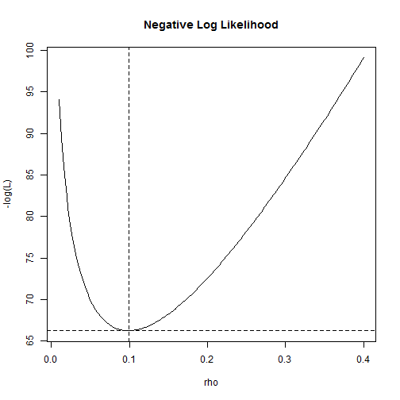
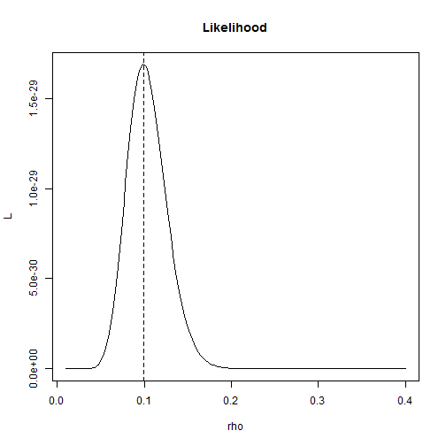
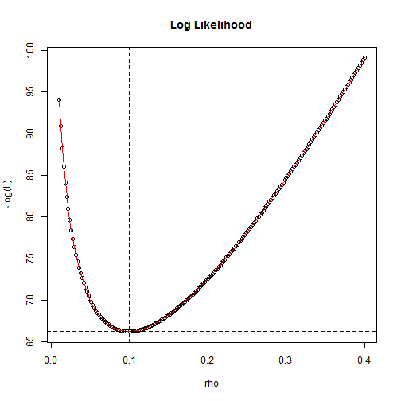
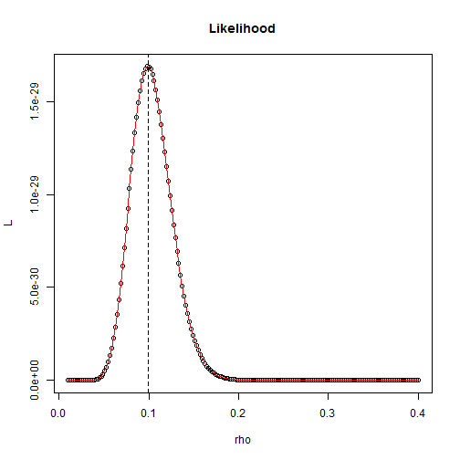
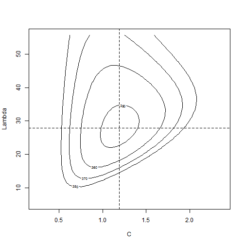
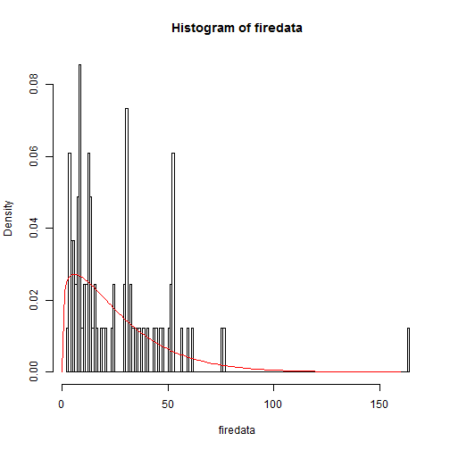
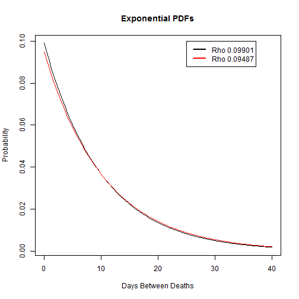

In this lab we will be looking at ways to implement Maximum Likelihood analyses in R, making use of both analytical solutions and numerical optimization.  This lab will present two “case study” examples and then ask you to work through a third example on your own.  This lab report will require you to come up with your own R code much more than the previous two, therefore you are strongly encourage to look at the assignment at the end before you start so that you know what you will be asked to do.  You will have all the tools you need to solve the assignment after the first case study so you might consider starting the assignment then so you have a greater chance of finishing the final independent part before the lab ends.

## Case study 1: Survival Analysis

Consider the example presented in lecture and in Section 3.2 of the book where the survival of a population of plants is being followed by an industrious graduate student conducting a drought experiment.  The goal of this analysis is to estimate the mortality rate, $\rho$.  The data records the day that each plant died, which has to be positive, and if we assume a constant mortality rate then the underlying process should conform to an exponential distribution:
 
$$L = Pr(a \vert \rho) \propto Exp(a \vert \rho) = \prod \rho \, exp(-\rho a_i)$$

First, lets load up the data set of the lifespan of individuals and take a quick look at the data.


```r
## vector of survival times (days)
dat <- c(1,9,9,5,27,9,29,1,11,3,3,11,13,6,11,2,4,1,37,10)

## some basic exploratory analysis
hist(dat)
```

 

```r
summary(dat)
```

```
##    Min. 1st Qu.  Median    Mean 3rd Qu.    Max. 
##     1.0     3.0     9.0    10.1    11.0    37.0
```

```r
n <- length(dat)
n
```

```
## [1] 20
```


This problem has an analytical solution for the Maximum Likelihood Estimator (MLE), which we solved for earlier.  In order to illustrate the different ways to approach this problem we will solve the problem both analytically and numerically.  From eqn 3.4 we know the MLE of $\rho$ to be


```r
##Analytical solution
rho_mle <- 1/mean(dat)
rho_mle
```

```
## [1] 0.09901
```

Recall that when solving for this analytical solution we first transformed the likelihood into the negative log-likelihood in order to make the arithmetic simpler, but that because this transformation is monotonic it doesn't change the optimum.  The negative log likelihood associated with our MLE estimate is found by plugging this value into the log-likelihood function

$$ -log(L) = -n \cdot log(\rho) + \rho \sum_{i=1}^{n} a_i$$


```r
## negative log-likelihood at solution
-n*log(rho_mle) + rho_mle*sum(dat)
```

```
## [1] 66.25
```

We can compare this likelihood with those for other possible values for $\rho$ by plotting the likelihood profile.  In order to do this lets define a function in R that calculates the negative log likelihood 


```r
## Negative log LiKelihood function for the EXPonential model
## Version 1
lkexp <- function(rho){
  -n*log(rho) + rho*sum(dat)
}
lkexp(rho_mle)
```

```
## [1] 66.25
```

As you can see, when we pass the MLE for $\rho$ to the function we just defined it returns the same value as when we calculated the likelihood explicitly.  The R syntax for defining a function involves assigning it a name (`lkexp <- function`), specifying what the function's parameters are ( `function(rho)` ), and specifying what the function computes ( everything between the { ... } ).  We now use this function to plot the likelihood in both the -log and linear domains as a function of the parameter $\rho$, adding a vertical line to indicate the value of $\rho$ where the MLE is and a horizontal line that shows the value of the likelihood function at the MLE.


```r
## likelihood profile

rseq <- seq(0.01,0.4,length=200)		## range of rho values on the x-axis

## Plot in the –log domain:
plot(rseq,lkexp(rseq),main="Negative Log Likelihood",
	xlab="rho",ylab="-log(L)",type='l')
abline(v=rho_mle,lty=2)
abline(h=lkexp(rho_mle),lty=2)
```

 

```r
## Plot in the linear domain
plot(rseq,exp(-lkexp(rseq)),main="Likelihood",xlab="rho",ylab="L",type='l')
abline(v=rho_mle,lty=2)
```

 

This approach to finding the likelihood and plotting the likelihood profile presumes that we've already solved the analytical solution for the log-likelihood.  If we want to avoid deriving that solution we can also express the log-likelihood in terms of the PDFs that we studied in lab last week.  We're modeling mortality rate based on an exponential distribution, so we can also find the likelihood using the `dexp` function.  Remember that in this context we are calculating the likelihood by *holding the data constant and varying the value of the parameter*.  In this case even though we're using the density function the plot of the function versus the parameter is no longer a density, as it would be if we held the parameters constant and looked at the probability of observing the data (i.e. the data on the x-axis).  As an example, if we wanted to find the likelihood of the first data-point conditional on the MLE for $\rho$ we could write
 

```r
dexp(dat[1],rho_mle)
```

```
## [1] 0.08968
```

While if we wanted the likelihoods of all the data-points we could calculate


```r
dexp(dat,rho_mle)
```

```
##  [1] 0.089677 0.040615 0.040615 0.060351 0.006834 0.040615 0.005607
##  [8] 0.089677 0.033318 0.073567 0.073567 0.033318 0.027333 0.054662
## [15] 0.033318 0.081223 0.066632 0.089677 0.002539 0.036786
```

We can express these values in terms of log-likelihoods by passing the optional argument “log = TRUE” to the PDF


```r
dexp(dat,rho_mle,log=TRUE)
```

```
##  [1] -2.412 -3.204 -3.204 -2.808 -4.986 -3.204 -5.184 -2.412 -3.402 -2.610
## [11] -2.610 -3.402 -3.600 -2.907 -3.402 -2.511 -2.709 -2.412 -5.976 -3.303
```

Note that while it is possible to take the log of the PDF – `log(dexp(dat,rho_mle))` – this gives a value that is numerically less precise.  More important to know is that the PDFs in R will occasionally return a zero when the probability of a value is very small due to computer round-off errors.  Taking the log of this value then gives a -Inf [negative infinity] rather a small finite value.

Recall that we are interested in the overall negative log-likelihood rather than the individual likelihoods, which in the log domain is simply the sum of the log-likelihoods times -1.  We can encapsulate this expression in a function just as we did before for the analytical log-likelihood
`-sum(dexp(dat,rho_mle,log=TRUE))`
 

```r
## likelihood function - version 2
lkexp2 <- function(rho){
  -sum(dexp(dat,rho,log=TRUE))
}
lkexp2(rho_mle)
```

```
## [1] 66.25
```

One important difference between lkexp2 and the original lkexp is that lkexp2 only makes sense if it’s passed a single value for $\rho$, while with lkexp we could pass a whole vector of rhos, rseq, in order to plot the likelihood.  If one passed a vector of rhos to lkexp2 then dexp would be applied to a vector of rhos and a vector of data simultaneously and by default R will compute the likelihood of the first data point given the first $\rho$, the second data point given the second $\rho$, etc. which is NOT what we're looking for. Fortunately R has a simple function -- “sapply” -- that allows you to apply a function to each value in a vector, which IS what we want.


```r
llk2 <- sapply(rseq,lkexp2)
```


We can make some simple plots to confirm that the two variants of the likelihood function do indeed give the same answer
 

```r
plot(rseq,lkexp(rseq),main="Log Likelihood",xlab="rho",ylab="-log(L)")
lines(rseq,llk2,col=2)
abline(v=rho_mle,lty=2)
abline(h=lkexp(rho_mle),lty=2)
```

 

```r
plot(rseq,exp(-lkexp(rseq)),main="Likelihood",xlab="rho",ylab="L")
lines(rseq,exp(-llk2),col=2)
abline(v=rho_mle,lty=2)
```

 

If we are dealing with a likelihood function that doesn't have an analytical solution, we can also approximate the solution using numerical optimization algorithms.  Fortunately, R has a number of such algorithms already built in.  One of these is “optimize”.


```r
## numerical optimization
fit <- optimize(lkexp,lower=0.01,upper=0.5,maximum=F)
fit
```

```
## $minimum
## [1] 0.09901
## 
## $objective
## [1] 66.25
```

Here the first argument of the optimize function is the function we want to optimize.  The next two specify the lower and upper bounds for the region we want to search.  The final argument specifies that we're looking for the minimum rather than the maximum – remember that minimizing the negative log likelihood is equivalent to maximizing the likelihood.  The optimize function returns two values: the “minimum,” which is the rho that minimizes the function, and the “objective” which is the value of the function at its minimum.  Since for this problem we know the analytical solution we can then compare the exact solution with the numerical approximation


```r
fit$minimum - rho_mle
```

```
## [1] 1.257e-06
```

```r
plot(rseq,exp(-lkexp(rseq)),main="Likelihood",xlab="rho",ylab="L")
lines(rseq,exp(-llk2),col=2)
abline(v=rho_mle,lty=2)
abline(v=fit$minimum,lty=2,col=2)
```

 

An alternative optimization function in R is “nlm” (nonlinear minimization).  The arguments for “nlm” are slightly different from “optimize”, the first still being the function to optimize but the second being a vector of the initial conditions the same length as the number of dimensions – the initial best guess of the parameters is used as the starting place for the optimization.


```r
fit2 <- nlm(lkexp,0.03)
fit2
```

```
## $minimum
## [1] 66.25
## 
## $estimate
## [1] 0.09901
## 
## $gradient
## [1] -1.789e-07
## 
## $code
## [1] 1
## 
## $iterations
## [1] 9
```

The output from “nlm” is mostly the same as for “optimize” but it includes a few other pieces of information.  The “gradient” is the numerical estimate of the slope at the numerical optimum (remember that at the optimum the slope should be zero).  The “code” indicates under what conditions the algorithm stopped.  Generally a 1 or 2 indicates that “nlm” is confident that it found a minimum, while values of 3-5 indicate failure for some reason.  Finally “iterations” reports the number of loops the algorithm performed in finding the solution.
  An important difference between “nlm” and “optimize” is that “optimize” is designed to work for 1-D problems (i.e. models with one parameter), while “nlm” will work on multi-parameter models.  In the second case study we will also introduce a third optimization function, “optim” that also works with multivariate problems.  Most of the time it doesn't matter which optimization routine you use, though they each work slightly differently, so if one approach fails it can be useful to check another.
	As discussed in lecture, remember that all numerical optimization algorithms can get stuck in local minima.  For this reason it is good practice to run such routines multiple times starting from multiple different initial locations to ensure they are all converging to the same point.  Obviously this does not guarantee that they are not all converging to the same local minima but it does reduce the risk, especially if the initial conditions are well distributed in parameter space rather than being too close together.  Different search methods have different sensitivities to local minima so if you suspect this is a problem you'll want to look up different methods and choose your algorithm carefully.  Finally, numerical methods can also run into trouble if the surface is not smooth and continuous (fortunately most likelihoods meet these criteria).

### Lab Questions

```
1) Include code to make a plot of the exponential PDF (with the MLE parameter estimate) on top of the histogram of the data.
```

## Case Study 2: Change in Fire Risk With Time

Fire ecologists summarize information on the distribution of intervals between fires as basis for inference on how the probability of fire might change with time since the last fire.  Here we will be using observations of fire intervals in Itasca State Park in northwestern Minnesota taken from fire scars on red pine trees that were aged using tree rings (Clark 1990).  Fire return interval are frequently analyzed using a Weibull distribution:

$$f(x \vert c, \lambda) = \left({{c}\over{\lambda}}\right)\left( {x \over \lambda} \right)^{c-1} exp\left( -\left( {x\over \lambda} \right)^c \right)$$

The Weibull is a generalization of the Exponential where the rate parameter either increases or decreases with time according to the parameter c.  You can see in the above PDF that when c=1 we recover the functional form for the Exponential.  In R the parameter c is called the “shape” while the parameter $\lambda$ is referred to as the “scale”.


```r
age = 0:160
plot(age,dweibull(age,1,50),type='l',ylab="density",ylim=c(0,0.025)) 
lines(age,dweibull(age,2,50),col="red") 
lines(age,dweibull(age,.5,50),col="green") 
```

 

### Lab Questions

```
2) Does increasing the “shape” parameter cause fire risk to increase or decrease with age?
3) Extra Credit: Plot the CDF of these 3 distributions. What is significant about the scale parameter? What is the analytical solution for the CDF at this point? Add these lines to your CDF plot.
```

Let’s begin by loading up the data set and take a quick look at it.  The data are actually stored as the number of times each return interval was observed, so our first step is to use “rep” to reconstruct the observations


```r
### Fire scar example
fireintervals <- read.table("data/firescar.txt",header=TRUE)
firedata <- rep(fireintervals[,1],fireintervals[,2])
hist(firedata,nclass=max(firedata),xlab="Years",main="Fire Return Interval")
```

 

```r
summary(firedata)
```

```
##    Min. 1st Qu.  Median    Mean 3rd Qu.    Max. 
##     2.0     9.0    16.0    26.1    36.8   164.0
```

Since the Weibull is a complex two-parameter model we'll be solving for the MLE numerically rather than trying to find an analytical solution.  As in the previous example, we do this by defining the negative log likelihood function that we want R to minimize.
 

```r
## define Weibull negative log likelihood
wlik <- function(param){
 -sum(dweibull(firedata, param[1], param[2], log = TRUE))
}
```

### Lab Questions

```
4) Since the exponential is a special case of the Weibull, use the code from the first case study to solve for the exponential MLE (rho_mle) for the fire scar data 
```

Next we'll specify the initial conditions for the numerical optimization – it doesn't matter what values you actually start from provided they are reasonable since they are just our first guess, though the closer you are to the correct value the less likely you are to end up in a local minima and the faster the algorithm will find the minima.  Below we start with the MLE for the Exponential special case.
 

```r
param0 <- c(1.0,1/rho_mle)  	##initial condition for numerical optimization
wlik(param0)
```

```
## [1] 401.3
```

As in the first example, we will call upon one of R's built in optimization functions to search parameter space and find the combination of parameters that has the lowest negative log likelihood.


```r
out <- optim(param0,wlik,lower=c(0.01,0.01), upper=c(100,100),method="L-BFGS-B")
out
```

```
## $par
## [1]  1.189 27.801
## 
## $value
## [1] 347.4
## 
## $counts
## function gradient 
##       13       13 
## 
## $convergence
## [1] 0
## 
## $message
## [1] "CONVERGENCE: REL_REDUCTION_OF_F <= FACTR*EPSMCH"
```

Next, we can visually check whether we chose an appropriate probability distribution by comparing it to the data
 

```r
hist(firedata,probability=TRUE,nclass=max(firedata))
lines(age,dweibull(age,out$par[1],out$par[2]),col=2)
```

 

Since the Weibull model has two parameters we'll want to look at the likelihood as a surface rather than just as a one dimensional likelihood profile to see how the estimates of the parameters are related to each other.  To do this we'll define a sequence of values for both parameters that range from 20% to 200% of the MLEs.  We'll then evaluate the likelihood across all combinations of both parameters, using a loop within a loop, and store the values in a matrix, z.
 

```r
nstep <- 40  
z <- matrix(NA,nrow=nstep,ncol=nstep)		## matrix to store results
rp <- seq(0.2,2,length=nstep)				## sequence from 20%-200%
for(i in 1:nstep){					## loop over the first dimension
  c <- rp[i]*out$par[1]		#c value
  for(j in 1:nstep){
    lambda <- rp[j]*out$par[2]		#lamba values
    z[i,j] <- wlik(c(c,lambda))
  }
}
```

We then use the R function “contour” to make a contour plot of the two dimensional likelihood surface.    Contour plots are read the same way that topo maps are, though in this case we're looking at the hills and valleys of the likelihood surface.


```r
contour(rp*out$par[1],rp*out$par[2],z,levels=c(350,360,370,380)
  	,xlab="C",ylab="Lambda")
## add the  MLE's
abline(v=out$par[1],lty=2)
abline(h=out$par[2],lty=2)
points(1,1/rho_mle,col=2)		## MLE for exponential special case
```

 

If the two variables are uncorrelated then contour plot will show ellipses that are perfectly round and oriented either up and down or side to side but not on a diagonal.  From this contour plot we see that there are some mild correlation between the two parameters.

## Case study 3: Binomial/Exponential Mortality

In the first example of plant mortality, the data consist of the ages at which different individuals died, presumably obtained by the aforementioned industrious graduate student censusing the population every day until every individual was dead.  Supposed instead that this student's advisor, who clearly doesn't go into the field every single day, decides instead to only census the population on day 20.  The advisor would have observed the following data instead, where 0 is a dead plant and 1 is a live plant:


```r
surv = c(0,0,0,0,1,0,1,0,0,0,0,0,0,0,0,0,0,0,1,0)
n = length(surv)
y = sum(surv)
```

We again want to estimate the per-capita daily mortality rate, $\rho$, but this time we will instead use the combined binomal/exponential model covered in Section 3.4 of the text.

As a reminder we start with the binomial model expressed in terms of q, the probability of surviving to the census at day 20
 
$$L = Binom(y \vert N, \theta) \propto \theta^y (1-\theta)^{N-y}$$

and then substitute in the exponential model for the probability of surviving to a given time t, exp(-rt), where we're interested in survival to the census at time T = 20.
 
$$L = Binom(y \vert N, \rho) \propto e^{-\rho T y} \left( 1-e^{-\rho T} \right)^{N-y}$$

Apply one of the **numerical methods** you used above in order to estimate $\rho$.

## Lab Questions

```
5) Please include the following in your answer:
*  R code
*  Numerical estimate of rho
*  Negative log likelihood profile
*  Answer the following question:  If we wanted to test the assumption that mortality rate was constant in time, which of the two data sets could we use and what model would we fit?
6) Extra Credit: A plot of the exponential PDF with two curves, one based on the Exponential model from the start of this lab and the second from the Binomial/Exponential fit you just found 
```

