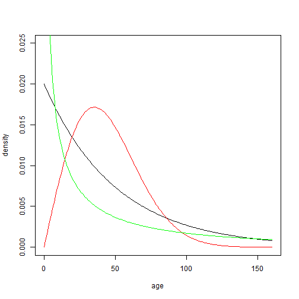
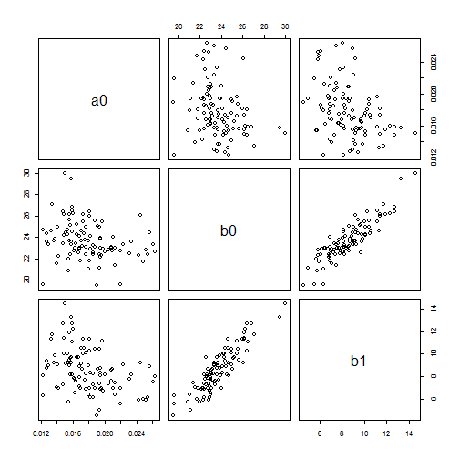
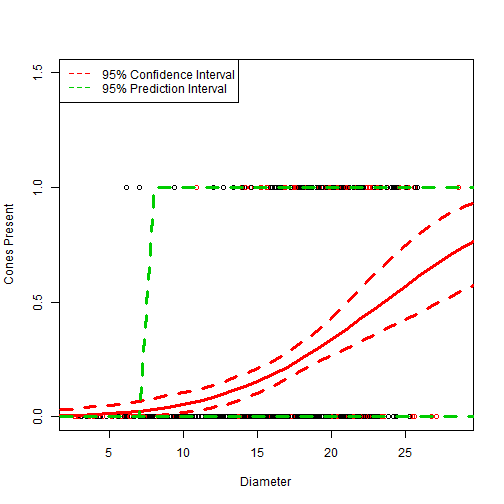

## Case study 1: Survival Analysis

Consider the example presented in lecture and in Section 3.2 of the book where the survival of a population of plants is being followed by an industrious graduate student conducting a drought experiment.  The goal of this analysis is to estimate the mortality rate, $\rho$.  The data records the day that each plant died, which has to be positive, and if we assume a constant mortality rate then the underlying process should conform to an exponential distribution:
 
$$L = Pr(a \vert \rho) \propto Exp(a \vert \rho) = \prod \rho \, exp(-\rho a_i)$$

First, let's load up the data set of the lifespan of individuals and take a quick look at the data.


```r
## vector of survival times (days)
dat <- c(1,9,9,5,27,9,29,1,11,3,3,11,13,6,11,2,4,1,37,10)
n <- length(dat)

##Analytical solution
rho_mle <- 1/mean(dat)

## negative log-likelihood at solution
# -n*log(rho_mle) + rho_mle*sum(dat)

## Negative log LiKelihood function for the EXPonential model
## Version 1
lkexp <- function(rho, dat){
  n = length(dat)
  -n*log(rho) + rho*sum(dat)
}
# lkexp(rho_mle) # Same result as above
```

As you can see, when we pass the MLE for $\rho$ to the function we just defined it returns the same value as when we calculated the likelihood explicitly.  The R syntax for defining a function involves assigning it a name (`lkexp <- function`), specifying what the function's parameters are ( `function(rho)` ), and specifying what the function computes ( everything between the { ... } ).  We now use this function to plot the likelihood in both the -log and linear domains as a function of the parameter $\rho$, adding a vertical line to indicate the value of $\rho$ where the MLE is and a horizontal line that shows the value of the likelihood function at the MLE.


```r
## likelihood profile

rseq <- seq(0.01,0.4,length=200)		## range of rho values on the x-axis

## Plot in the –log domain:
plot(rseq,lkexp(rseq,dat),main="Negative Log Likelihood",
	xlab="rho",ylab="-log(L)",type='l')
abline(v=rho_mle,lty=2)
abline(h=lkexp(rho_mle,dat),lty=2)
```

 


### Lab Questions

**Q 1:** Include code to make a plot of the exponential PDF (with the MLE parameter estimate) on top of the histogram of the data.

**A:**

```r
hist(dat, freq=F)
# Sort  (dat,dexp(dat,rho_mle))
lines(sort(dat), dexp(sort(dat), rate = rho_mle))
```

 

## Case Study 2: Change in Fire Risk With Time

Fire ecologists summarize information on the distribution of intervals between fires as basis for inference on how the probability of fire might change with time since the last fire.  Here we will be using observations of fire intervals in Itasca State Park in northwestern Minnesota taken from fire scars on red pine trees that were aged using tree rings (Clark 1990).  Fire return interval are frequently analyzed using a Weibull distribution:

$$f(x \vert c, \lambda) = \left({{c}\over{\lambda}}\right)\left( {x \over \lambda} \right)^{c-1} exp\left( -\left( {x\over \lambda} \right)^c \right)$$

The Weibull is a generalization of the Exponential where the rate parameter either increases or decreases with time according to the parameter c.  You can see in the above PDF that when c=1 we recover the functional form for the Exponential.  In R the parameter c is called the “shape” while the parameter $\lambda$ is referred to as the “scale”.


```r
age = 0:160
plot(age,dweibull(age,1,50),type='l',ylab="density",ylim=c(0,0.025)) 
lines(age,dweibull(age,2,50),col="red") 
lines(age,dweibull(age,.5,50),col="green") 
```

 

### Lab Questions


**Q 2:** Does increasing the “shape” parameter cause fire risk to increase or decrease with age?

**A:** A larger shape parameter causes the risk of fire to increase with age. This causes a bump in the PDF as fire risk reaches the scale proportion ($\lambda$).

**Q 3:** Extra Credit: Plot the CDF of these 3 distributions. What is significant about the scale parameter? What is the analytical solution for the CDF at this point? Add these lines to your CDF plot.

**A:** 


```r
age = 0:160
plot(age,pweibull(age,1,50),type='l',ylab="density",ylim=c(0,1)) 
lines(age,pweibull(age,2,50),col="red") 
lines(age,pweibull(age,.5,50),col="green")
abline(v = 50, lty=2)
abline(h = pweibull(50,1,50), lty=2)
```

 

```r
pweibull(50,1,50)
```

```
## [1] 0.6321
```

```r
# The scale parameter scales the time-to-failure. Here k=50 rescales time so that 50 years old is unity. Interestingly enough the inflection point of the k=2 value lines up with the other two cumulative densities. On reflection this is a result of the integral of e^-t (rescaled time) having a unity coefficient on time.

# From the CDFs it also becomes more apparent that k>1 is an increasing rate of fire occurence.
```

##  Fire Data

Let's begin by loading up the data set and take a quick look at it.  The data are actually stored as the number of times each return interval was observed, so our first step is to use “rep” to reconstruct the observations


```r
### Fire scar example
fireintervals <- read.table("data/firescar.txt",header=TRUE)
firedata <- rep(fireintervals[,1],fireintervals[,2])
hist(firedata,nclass=max(firedata),xlab="Years",main="Fire Return Interval")
```

 

```r
summary(firedata)
```

```
##    Min. 1st Qu.  Median    Mean 3rd Qu.    Max. 
##     2.0     9.0    16.0    26.1    36.8   164.0
```

Since the Weibull is a complex two-parameter model we'll be solving for the MLE numerically rather than trying to find an analytical solution.  As in the previous example, we do this by defining the negative log likelihood function that we want R to minimize.
 

```r
## define Weibull negative log likelihood
wlik <- function(param){
 -sum(dweibull(firedata, param[1], param[2], log = TRUE))
}
```

### Lab Questions


**Q 4:** Since the exponential is a special case of the Weibull, use the code from the first case study to solve for the exponential MLE (rho_mle) for the fire scar data.
 
**A:**


```r
fit <- optimize(lkexp,lower=0.0001,upper=2,maximum=F, dat=firedata)
fit$minimum
```

```
## [1] 0.03836
```

```r
hist(firedata,nclass=max(firedata),xlab="Years",main="Fire Return", freq=F)
lines(age, dexp(x = age, rate = fit$minimum,), col="red")
```

 

Next we'll specify the initial conditions for the numerical optimization – it doesn't matter what values you actually start from provided they are reasonable since they are just our first guess, though the closer you are to the correct value the less likely you are to end up in a local minima and the faster the algorithm will find the minima.  Below we start with the MLE for the Exponential special case.
 

```r
param0 <- c(1.0,1/rho_mle)  	##initial condition for numerical optimization
wlik(param0)
```

```
## [1] 401.3
```

As in the first example, we will call upon one of R's built in optimization functions to search parameter space and find the combination of parameters that has the lowest negative log likelihood.


```r
out <- optim(param0,wlik,lower=c(0.01,0.01), upper=c(100,100),method="L-BFGS-B")
out
```

```
## $par
## [1]  1.189 27.801
## 
## $value
## [1] 347.4
## 
## $counts
## function gradient 
##       13       13 
## 
## $convergence
## [1] 0
## 
## $message
## [1] "CONVERGENCE: REL_REDUCTION_OF_F <= FACTR*EPSMCH"
```

Next, we can visually check whether we chose an appropriate probability distribution by comparing it to the data
 

```r
hist(firedata,probability=TRUE,nclass=max(firedata))
lines(age,dweibull(age,out$par[1],out$par[2]),col=2)
```

 

Since the Weibull model has two parameters we'll want to look at the likelihood as a surface rather than just as a one dimensional likelihood profile to see how the estimates of the parameters are related to each other.  To do this we'll define a sequence of values for both parameters that range from 20% to 200% of the MLEs.  We'll then evaluate the likelihood across all combinations of both parameters, using a loop within a loop, and store the values in a matrix, z.
 

```r
nstep <- 40  
z <- matrix(NA,nrow=nstep,ncol=nstep)		## matrix to store results
rp <- seq(0.2,2,length=nstep)				## sequence from 20%-200%
for(i in 1:nstep){					## loop over the first dimension
  c <- rp[i]*out$par[1]		#c value
  for(j in 1:nstep){
    lambda <- rp[j]*out$par[2]		#lamba values
    z[i,j] <- wlik(c(c,lambda))
  }
}
```

We then use the R function “contour” to make a contour plot of the two dimensional likelihood surface.    Contour plots are read the same way that topo maps are, though in this case we're looking at the hills and valleys of the likelihood surface.


```r
contour(rp*out$par[1],rp*out$par[2],z,levels=c(350,360,370,380)
  	,xlab="C",ylab="Lambda")
## add the  MLE's
abline(v=out$par[1],lty=2)
abline(h=out$par[2],lty=2)
points(1,1/rho_mle,col=2)		## MLE for exponential special case
```

 

If the two variables are uncorrelated then contour plot will show ellipses that are perfectly round and oriented either up and down or side to side but not on a diagonal.  From this contour plot we see that there are some mild correlation between the two parameters.

## Case study 3: Binomial/Exponential Mortality

In the first example of plant mortality, the data consist of the ages at which different individuals died, presumably obtained by the aforementioned industrious graduate student censusing the population every day until every individual was dead.  Supposed instead that this student's advisor, who clearly doesn't go into the field every single day, decides instead to only census the population on day 20.  The advisor would have observed the following data instead, where 0 is a dead plant and 1 is a live plant:


```r
surv = c(0,0,0,0,1,0,1,0,0,0,0,0,0,0,0,0,0,0,1,0)
n = length(surv)
y = sum(surv)
```

We again want to estimate the per-capita daily mortality rate, $\rho$, but this time we will instead use the combined binomal/exponential model covered in Section 3.4 of the text.

As a reminder we start with the binomial model expressed in terms of q, the probability of surviving to the census at day 20
 
$$L = Binom(y \vert N, \theta) \propto \theta^y (1-\theta)^{N-y}$$

and then substitute in the exponential model for the probability of surviving to a given time t, exp(-rt), where we're interested in survival to the census at time T = 20.
 
$$L = Binom(y \vert N, \rho) \propto e^{-\rho T y} \left( 1-e^{-\rho T} \right)^{N-y}$$

Apply one of the **numerical methods** you used above in order to estimate $\rho$.

## Lab Questions

**Q 5:** Please include the following in your answer:
*  R code
*  Numerical estimate of rho
*  Negative log likelihood profile
*  Answer the following question:  If we wanted to test the assumption that mortality rate was constant in time, which of the two data sets could we use and what model would we fit?

**A:**


```r
lkbinomexp <- function(rho, N, t_survey, y){  
  return(rho*t_survey*y - (N-y)*(log(1-exp(-rho*t_survey))))
}

opt <- optimize(lkbinomexp, lower=0.001,upper=1,maximum=F, N = n, y=y, t_survey=20)
opt$minimum
```

```
## [1] 0.09487
```

```r
## Plot in the –log domain:
rseq <- seq(opt$minimum/2,opt$minimum*2,length=200)
plot(rseq,lkbinomexp(rseq,N = n, y = y , t_survey = 20),main="Negative Log Likelihood", xlab="rho",ylab="-log(L)",type='l')
abline(v=opt$minimum,lty=2)
abline(h=opt$objective,lty=2)
```

 

To assess the assumption of a constant mortality rate, the first data set must be used since it contains the dynamics. By contrast the second data set is a point measurement. Without the information contained in the first dataset, there is no way to resolve a changing rate.

A Weibull distribution can be fit to the data. The optimizing shape and rate parameters may be found and will yield an associated log-likelihood. A second log-likelihood may be calculated by fitting an exponential (or Weibull with fixed shape parameter). The two likelihoods may be combined to perform a likelihood ratio test yielding the p-value associated with a non-zero shape parameter.


**Q 6:** Extra Credit: A plot of the exponential PDF with two curves, one based on the Exponential model from the start of this lab and the second from the Binomial/Exponential fit you just found .

**A:**


```r
x <- seq(from = 0, to = 40,length.out = 200)
plot(x, dexp(x = x, rate = rho_mle),main="Exponential PDFs", xlab="Days Between Deaths",ylab="Probability",type='l')
lines(x, dexp(x = x, rate = opt$minimum), col="red")
legend(25, 0.1, paste("Rho", round(c(rho_mle, opt$minimum),5)),
                  lty=c(1,1),
                  lwd=c(2.5,2.5),col=c("black","red"))
```

 

