  
The objective for this lab is to apply the frequentist tools for generating confidence and predictive intervals and for selecting among models. In the course of this lab we will revisit some of the case studies we presented earlier in the semester when we were focused on point estimation.

## Case Study: Lab 4 pine cones data

In Lab 4 we investigated the effect that elevated CO2 has on tree reproduction by fitting a nonlinear model that accounted for both tree reproductive maturation and overall tree fecundity.  In that Lab we performed a Likelihood Ratio Test that showed that CO2 did have a significant effect on tree reproduction.  In this lab we will complete this analysis by estimating confidence intervals on the model parameters, as well as model confidence and predictive intervals, using bootstrap methods.  We will also compare the results of the LRT with model selection using AIC.

As a reminder, our model had included tree size, as measured by stem diameter (dia), as the primary covariate.  This model had two parts.  First, tree reproductive maturation was modeled as a probit function, $\theta = probit(x \vert b_0,b_1)$, that described the probability that a tree was reproductive.  Second, the function $g = a_0x^2$ described the fecundity in terms of the number of pine cones produced conditional on the tree being reproductive.  Recall that in order to account for observation error (observing no cones on a tree that is mature) we had to fit both models simultaneously.

We'll pick up from where we were at the end of Lab 4 by loading up the the state of the R workspace at the end of that lab:


```r
load("data/Lab8_cone.RData")
```

At this point we had fit the pine cone count data to the whole data set (out), to just the ambient CO2 data (out.amb) and to just the elevated CO2 data (out.elev).

###  AIC vs Likelihood Ratio Test

Let's begin by calculating the AIC for the two models.  We had previously stored the negative log likelihoods in a vector named lnL that contained the values for (combined, amb, elev).  To estimate AIC we need to know the total number of parameters for each model.  For the model that analyzes the combined data there are 3 parameters, a0, b0, and b1.  Because we did not use a Normal likelihood there's not an additional variance parameter that needs to be estimated.  The model that treats ambient and elevated CO2 as separate treatments thus has 6 parameters.


```r
AIC.combined = 2*lnL[1] + 2*3
AIC.treatment  = 2*(lnL[2]+lnL[3]) + 2*6
AIC.combined
```

```
## [1] 2600
```

```r
AIC.treatment
```

```
## [1] 2556
```

**Lab Report Task 1**
Compare the AICs for the two models, interpret the results for this test, and compare with the results from the LRT previously performed.

```r
exp((AIC.treatment-AIC.combined)/2)
```

```
## [1] 2.59e-10
```

```r
dev.null = 2*lnL[1]
dev.tmt  = 2*lnL[2] + 2*lnL[3]
dev = dev.null - dev.tmt
pval = 1-pchisq(dev,3)
pval
```

```
## [1] 7.43e-11
```
The first number is the probability that the combined model minimizes the information loss from the AIC. The AIC indicates that the treatement model is a more parsimonious choice.

The second number is the p value associated with the null model (base) in the presence of the alternative.

The two tests are essentially telling us the same thing: the alternative model (the treatment model) is the more parsimonious one.

That is, we should model each of the treatment groups separately (AMB, CO2).

## Bootstrapped Interval Estimates

Next, let's calculate the bootstrap confidence and predictive intervals.  This begins by setting up variables that control the sampling and storage for the output.  All of the code to follow for calculating bootstrapped intervals is very similar to the code we've used in the last two labs to generate interval estimates from MCMC output.  One important difference is that since all of the bootstrap estimates are independent we can generally get away with a smaller sample size because there is no issue of autocorrelation or burn-in.  The other important difference is in how we are treating the data and the parameters - in the bootstrap we're generating random DATA while in the MCMC the data are fixed but the parameters are random.

**For your report, make sure to set nboot to an appropriate number of replicates**
  

```r
## bootstrap
nboot <- 5000    		## number of bootstrap samples
npred <- 31				## number of X values you predict for
dseq  <- seq(0,30,length=npred)		## diameter sequence
mle   <- matrix(NA,nrow=nboot,ncol=3)	## storage for parameter estimates
conf.mat  <- matrix(NA,nrow=nboot,ncol=npred)	## storage for maturation
conf.cone <- matrix(NA,nrow=nboot,ncol=npred)	## storage for fecundity
pred.mat   <- matrix(NA,nrow=nboot,ncol=npred)	## storage for predictive maturation
pred.cone <- matrix(NA,nrow=nboot,ncol=npred)	## storage for predictive fecundity
```

Next we'll specify the data set that we'll be sampling from.  In this case we'll begin by constructing interval estimates for the ambient CO2 data


```r
## Ambient
dia.t   <- b$diam[tmt=="AMB"]   ## tree diameters
cones.t <- (b$c00 > 0)         ## whether cones are present
cones.t <- cones[tmt=="AMB"]
ncone.t <- b$c00[tmt=="AMB"]    ## number of cones
```

Next is the main bootstrap loop.  There are a number of steps to this process as we'll be generating both the parameters CI and the model CI and PI in one large loop.  In the first part we define the resampled data set, making sure to sample so that we keep all xy pairs of data together.  Next we'll fit the model to the resampled data using numerical optimization and store those parameters.  After that we'll calculate the mean model prediction given the most recent set of parameters in order to calculate the model confidence interval.  Finally we'll simulate pseudodata from the model to calculate the model predictive interval.


```
## [1] 100
## [1] 200
## [1] 300
## [1] 400
## [1] 500
## [1] 600
## [1] 700
## [1] 800
## [1] 900
## [1] 1000
## [1] 1100
## [1] 1200
## [1] 1300
## [1] 1400
## [1] 1500
## [1] 1600
## [1] 1700
## [1] 1800
## [1] 1900
## [1] 2000
## [1] 2100
## [1] 2200
## [1] 2300
## [1] 2400
## [1] 2500
## [1] 2600
## [1] 2700
## [1] 2800
## [1] 2900
## [1] 3000
## [1] 3100
## [1] 3200
## [1] 3300
## [1] 3400
## [1] 3500
## [1] 3600
## [1] 3700
## [1] 3800
## [1] 3900
## [1] 4000
## [1] 4100
## [1] 4200
## [1] 4300
## [1] 4400
## [1] 4500
## [1] 4600
## [1] 4700
## [1] 4800
## [1] 4900
## [1] 5000
```

Once we've generated the bootstrap sample we'll want to begin by looking at the parameter level estimates.  Lets first calculate the confidence intervals for each parameter using "quantile" and then use a pairs plot to assess parameter correlations.


```r
# Quantiles of the MLE parameter estimates pulled from in-sample bootstraps
colnames(mle) = c("a0","b0","b1")
a0.ci <- quantile(mle[,1],c(0.025,0.975))
b0.ci <- quantile(mle[,2],c(0.025,0.975))
b1.ci <- quantile(mle[,3],c(0.025,0.975))
pairs(mle)
```

 

**Lab Report Task 2**
Generate density and CI plots for all 3 model parameters.  Include three figures and a table of parameter estimates, standard errors, and CI.


```r
# Next, construct density plots for each of these parameters and add both the MLE and the confidence intervals.

## a0
i = 1
plot(density(mle[,i], width=0.005),type='l',xlim=c(min(mle[,i]),max(mle[,i])),ylim=c(0,150), main="Density of a0")
abline(v=a0.ci,lty=2)
abline(v=a0[2])  # Parameter from estimate on original data, AMB model
```

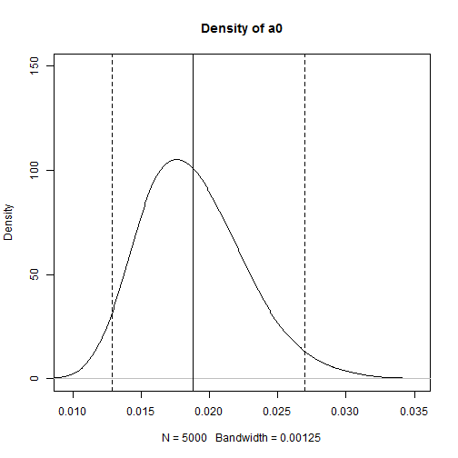 

```r
## b0
i = 2
plot(density(mle[,i]),type='l',xlim=c(min(mle[,i]),max(mle[,i])),ylim=c(0,1), main="Density of b0")
abline(v=b0.ci,lty=2)
abline(v=b0[2])
```

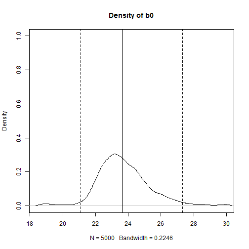 

```r
## b1
i = 3
plot(density(mle[,i]),type='l',xlim=c(min(mle[,i]),max(mle[,i])),ylim=c(0,1), main="Density of b1")
abline(v=b1.ci,lty=2)
abline(v=b1[2])
```

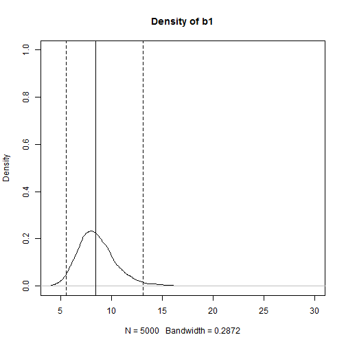 

```r
# Param Table
r1 <-c(MLE_est=a0[2], a0.ci, SE=sd(mle[,1]))
r2 <-c(MLE_est=b0[2], b0.ci, SE=sd(mle[,2]))
r3 <-c(MLE_est=b1[2], b1.ci, SE=sd(mle[,3]))
tab <-do.call(rbind,list(r1,r2,r3))
tab <- cbind(Param = list("a0","b0", "b1"),tab)
row.names(tab)<-NULL
tab
```

```
##      Param MLE_est 2.5% 97.5% SE  
## [1,] "a0"  0.01881 NULL NULL  NULL
## [2,] "b0"  23.64   NULL NULL  NULL
## [3,] "b1"  8.463   NULL NULL  NULL
```

### Model Intervals

Let's now move on to constructing the model confidence intervals and predictive intervals.  Since we have two process models for this analysis we construct intervals for both.


```r
ci.mat  <- apply(conf.mat,2,quantile,c(0.025,0.5,0.975))
ci.cone <- apply(conf.cone,2,quantile,c(0.025,0.5,0.975))
pi.mat  <- apply(pred.mat,2,quantile,c(0.025,0.975))
pi.cone <- apply(pred.cone,2,quantile,c(0.025,0.975)) 
```

Finally, lets plot the model confidence and predictive intervals and compare them to the data


```r
## fecundity plot
plot(b$diam,b$c00,col = b$tmt,ylim=c(0,30), ylab="Cones", xlab="Diameter")
lines(dseq,ci.cone[2,],col=2,lwd=3)   ## median model
lines(dseq,ci.cone[1,],col=2,lty=2,lwd=3)	## 95% CI
lines(dseq,ci.cone[3,],col=2,lty=2,lwd=3)
lines(dseq,pi.cone[1,],col=3,lty=2,lwd=3)	## 95% PI
lines(dseq,pi.cone[2,],col=3,lty=2,lwd=3)
legend("topleft",legend=c("95% Confidence Interval","95% Prediction Interval"),col=c(2,3),lty=c(2,2))
```

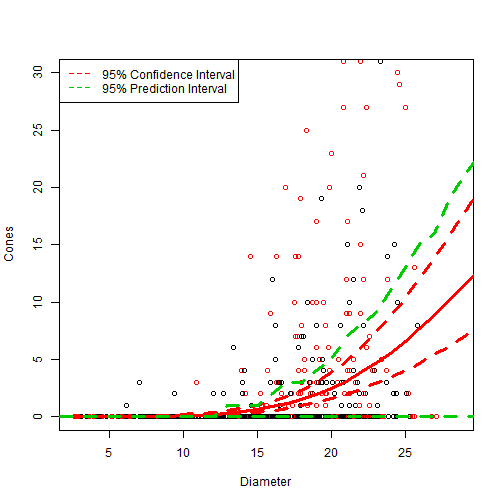 

**Lab Report Task 3** 
Plot the confidence and predictive interval for the maturation process model.  Include both this plot and the fecundity plot in your lab report.


```r
## maturation plot
plot(b$diam,b$c00>0,col = b$tmt,ylim=c(0,1.5), ylab="Cones Present", xlab="Diameter")
lines(dseq,ci.mat[2,],col=2,lwd=3)   ## median model
lines(dseq,ci.mat[1,],col=2,lty=2,lwd=3)  ## 95% CI
lines(dseq,ci.mat[3,],col=2,lty=2,lwd=3)
lines(dseq,pi.mat[1,],col=3,lty=2,lwd=3)	## 95% PI
lines(dseq,pi.mat[2,],col=3,lty=2,lwd=3)
legend("topleft",legend=c("95% Confidence Interval","95% Prediction Interval"),col=c(2,3),lty=c(2,2))
```

 


**Lab Report Task 4**
Repeat the bootstrap analysis for the elevated CO2 treatment.  Include the figures and tables from tasks 2 & 3 for the elevated plots as well as a final plot that compares the model confidence intervals between the elevated and ambient data on one figure

**Hidden code Below**

```
## [1] 100
## [1] 200
## [1] 300
## [1] 400
## [1] 500
## [1] 600
## [1] 700
## [1] 800
## [1] 900
## [1] 1000
## [1] 1100
## [1] 1200
## [1] 1300
## [1] 1400
## [1] 1500
## [1] 1600
## [1] 1700
## [1] 1800
## [1] 1900
## [1] 2000
## [1] 2100
## [1] 2200
## [1] 2300
## [1] 2400
## [1] 2500
## [1] 2600
## [1] 2700
## [1] 2800
## [1] 2900
## [1] 3000
## [1] 3100
## [1] 3200
## [1] 3300
## [1] 3400
## [1] 3500
## [1] 3600
## [1] 3700
## [1] 3800
## [1] 3900
## [1] 4000
## [1] 4100
## [1] 4200
## [1] 4300
## [1] 4400
## [1] 4500
## [1] 4600
## [1] 4700
## [1] 4800
## [1] 4900
## [1] 5000
```

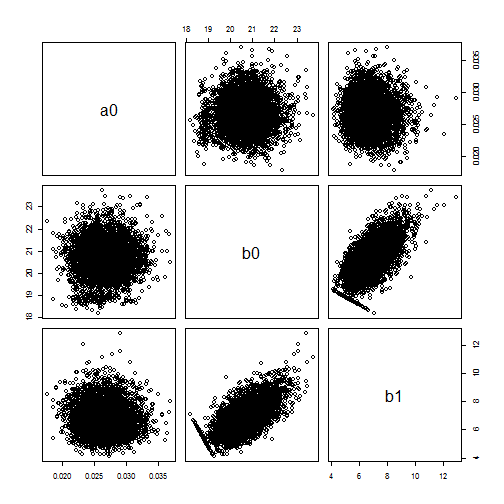 


```r
# Next, construct density plots for each of these parameters and add both the MLE and the confidence intervals.

## a0
i = 1
plot(density(mle[,i], width=0.005),type='l',xlim=c(min(mle[,i]),max(mle[,i])),ylim=c(0,150), main="Density of a0")
abline(v=a0.ci,lty=2)
abline(v=a0[3])  # Parameter from estimate on original data, AMB model
```

 

```r
## b0
i = 2
plot(density(mle[,i]),type='l',xlim=c(min(mle[,i]),max(mle[,i])),ylim=c(0,1), main="Density of b0")
abline(v=b0.ci,lty=2)
abline(v=b0[3])
```

 

```r
## b1
i = 3
plot(density(mle[,i]),type='l',xlim=c(min(mle[,i]),max(mle[,i])),ylim=c(0,1), main="Density of b1")
abline(v=b1.ci,lty=2)
abline(v=b1[3])
```

 

```r
# Param Table
r1 <-c(MLE_est=a0[3], a0.ci, SE=sd(mle[,1]))
r2 <-c(MLE_est=b0[3], b0.ci, SE=sd(mle[,2]))
r3 <-c(MLE_est=b1[3], b1.ci, SE=sd(mle[,3]))
tab <-do.call(rbind,list(r1,r2,r3))
tab <- cbind(Param = list("a0","b0", "b1"),tab)
row.names(tab)<-NULL
tab
```

```
##      Param MLE_est 2.5% 97.5% SE  
## [1,] "a0"  0.02677 NULL NULL  NULL
## [2,] "b0"  20.65   NULL NULL  NULL
## [3,] "b1"  6.777   NULL NULL  NULL
```

```r
ci.mat  <- apply(conf.mat,2,quantile,c(0.025,0.5,0.975))
ci.cone <- apply(conf.cone,2,quantile,c(0.025,0.5,0.975))
pi.mat  <- apply(pred.mat,2,quantile,c(0.025,0.975))
pi.cone <- apply(pred.cone,2,quantile,c(0.025,0.975)) 

## fecundity plot
plot(b$diam,b$c00,col = b$tmt,ylim=c(0,30), ylab="Cones", xlab="Diameter")
lines(dseq,ci.cone[2,],col=2,lwd=3)   ## median model
lines(dseq,ci.cone[1,],col=2,lty=2,lwd=3)  ## 95% CI
lines(dseq,ci.cone[3,],col=2,lty=2,lwd=3)
lines(dseq,pi.cone[1,],col=3,lty=2,lwd=3)	## 95% PI
lines(dseq,pi.cone[2,],col=3,lty=2,lwd=3)
legend("topleft",legend=c("95% Confidence Interval","95% Prediction Interval"),col=c(2,3),lty=c(2,2))
```

 

```r
## maturation plot
plot(b$diam,b$c00>0,col = b$tmt,ylim=c(0,1.5), ylab="Cones Present", xlab="Diameter")
lines(dseq,ci.mat[2,],col=2,lwd=3)   ## median model
lines(dseq,ci.mat[1,],col=2,lty=2,lwd=3)  ## 95% CI
lines(dseq,ci.mat[3,],col=2,lty=2,lwd=3)
lines(dseq,pi.mat[1,],col=3,lty=2,lwd=3)	## 95% PI
lines(dseq,pi.mat[2,],col=3,lty=2,lwd=3)
legend("topleft",legend=c("95% Confidence Interval","95% Prediction Interval"),col=c(2,3),lty=c(2,2))
```

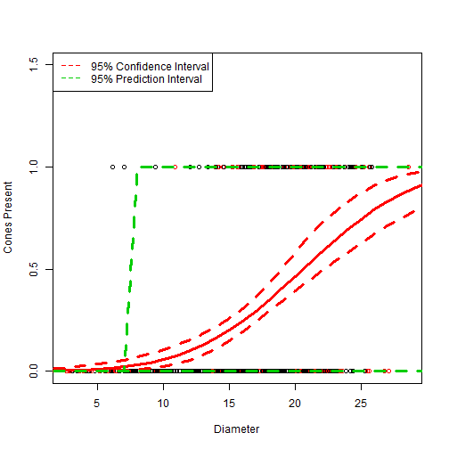 

```r
# ...a final plot that compares the model confidence intervals between the elevated and ambient data on one figure

b$col<-NA
b$col[b$tmt=="AMB"]<-2
b$col[b$tmt=="CO2"]<-3

plot(b$diam,b$c00,col = b$col,ylim=c(0,30), ylab="Cones", xlab="Diameter")
lines(dseq,amb$ci.cone[2,],col=2,lwd=3)        ## median AMB model
lines(dseq,amb$ci.cone[1,],col=2,lty=2,lwd=3)  ## 95% CI AMB
lines(dseq,amb$ci.cone[3,],col=2,lty=2,lwd=3)
lines(dseq,ci.cone[2,],col=3,lwd=3)       ## median CO2 model
lines(dseq,ci.cone[1,],col=3,lty=2,lwd=3)     ## 95% CI CO2
lines(dseq,ci.cone[3,],col=3,lty=2,lwd=3)
legend("topleft",legend=c("95% CI AMB","95% CI CO2"),col=c(2,3),lty=c(2,2))
```

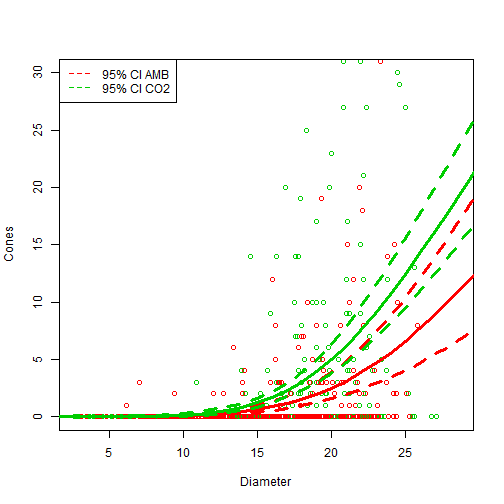 

```r
#save results
co2 <- list(mle=mle, conf.mat=conf.mat, conf.cone=conf.cone, pred.mat=pred.mat, pred.cone=pred.cone, a0=a0 ,b0=b0,b1=b1, tab=tab, ci.mat=ci.mat, pi.mat=pi.mat, ci.cone = ci.cone, pi.cone = pi.cone)
```


**Extra Credit:  Likelihood Profile Interval Estimates: Lab 3 Fire Scar data**

Recall in Lab 3 we investigated the distribution of fire return intervals in Itasca State Park in northwestern Minnesota.  In that lab we fit a Weibull distribution to the fire interval data.  Recall that the Weibull is a generalization of the exponential that allows the rate parameter to either increase or decrease with time and the exponential can be recovered by setting c=1.  In this lab we revisit this analysis in order to estimate confidence intervals for the MLE parameters we previously found to test whether or not the fire risk is constant or increasing with time.

For estimation of parameter confidence intervals we will use the likelihood profile technique.  Following this we will use a Likelihood Ratio Test to test the Weibull model against the Exponential.

Rather than re-running the whole code for Lab 3, let's load up the saved image of the workspace as it was at the end of that lab.


```r
load("data/Lab8_fire.RData")
```

Where we left off we had just fit the MLE numerically, the output of which is stored in the variable "out", and then constructed a 2D contour plot of the likelihood surface by calculating the likelihood on a grid "z" for values that ranged from 20%-200% of the MLE (variable rp).  Let's start by replotting that contour plot


```r
c_mle = out$par[1]  	## MLE for the parameter "C"
lam_mle = out$par[2]		## MLE for the parameter "Lambda"
contour(rp*c_mle,rp*lam_mle,z,levels=c(350,360,370,380),xlab="C",ylab="Lambda")
## add the  MLE's
abline(v=c_mle,lty=2)
abline(h=lam_mle,lty=2)
```

 

In order to estimate the confidence intervals for each parameter we need to be able to go from this likelihood surface to the likelihood profiles for each variable.  Because of the covariance between these variables this is not simply the profile along the horizontal and vertical lines we've plotted. Instead it requires that we specify a sequence of values for the parameter of interest, and then sequentially find the MLE for all other parameters in the model while holding the parameter of interest constant at a specified value along the profile. For each parameter, we'll loop over a vector of parameter values, find the MLE at each point, and we record the corresponding likelihood.  In this way we'll end up with the likelihood profile for that parameter  To estimate these profiles we need to define two new likelihood functions that each find the minimum likelihood for a specific value of our parameter of interest by searching over the values of the other parameter(s).


```r
## likelihood profile
prof_lam <- function(c,lambda){   ## find the MLE holding lambda at a constant
-sum(dweibull(firedata,c,lambda,log=TRUE))
}
prof_c <- function(lambda,c){    ## find the MLE holding C at a constant
-sum(dweibull(firedata,c,lambda,log=TRUE))
}
```

While these functions LOOK identical, in the first the value for lambda is being held constant and the optimization routine will vary the value of C to find the MLE while in the second the C is held constant and lambda is varied.  To construct the likelihood profiles we'll then loop over a sequence of values for one variable and find the MLE of the other.  When looking at the following code, remember that optimize returns a minimum, which is the parameter value, and an objective that is result of evaluating the function at that minimum (which in our case is the negative log likelihood).  
Let's begin with the profile for lambda


In the last line of the code we add points to the likelihood surface plot that show's the MLE of C at each of the lambda values we evaluated.  In other words, this is the line along the likelihood surface that lets you know where we are computing the likelihood profile (which we'll plot in just a minute).  If you imagine the likelihood surface as a valley, as you walked from north to south carrying a GPS this path would always keep you at the minimum you could be at with each step and the resulting plot of elevation (likelihood) vs latitude (lambda) would be the likelihood profile itself.  The equivalent profile for C would be the lowest path walking east to west.
                                                                                                                                                                                                                                                                               
                                                                                                                                                                                                                                                                               **Lab Report Task 5**
                                                                                                                                                                                                                                                                               Modify the previous section of code to calculate the vector c.like, that is found by fixing the value of C and fitting using the prof_c likelihood function.  Be aware that you will need to flip many components of the code, including the order of the two variables in the "points" command.  Turn in the following:
                                                                                                                                                                                                                                                                               

```r
lambdas     = lam_mle*rp        ## sequence of lambda values being evaluated
lambda.like = numeric(nstep)    ## storage for lambda likelihood values
CgivenL     = numeric(nstep)	  ## storage for c value that pairs with the lambda

cs          = c_mle*rp ##
c.like      = numeric(nstep)
LgivenC     = numeric(nstep)
for(i in 1:nstep){			        
  lout <- optimize(prof_lam,interval=range(c_mle*rp),maximum=FALSE,lambda=lambdas[i])
  lambda.like[i] <- lout$objective      ## save the likelihood
  CgivenL[i] = lout$minimum	            ## save the MLE of c
  
  cout <- optimize(prof_c,interval=range(lam_mle*rp),maximum=FALSE,c=cs[i])
  c.like[i] <- cout$objective      ## save the likelihood
  LgivenC[i] = cout$minimum        ## save the MLE of L 
}

contour(rp*c_mle,rp*lam_mle,z,levels=c(350,360,370,380),xlab="C",ylab="Lambda")
abline(v=c_mle,lty=2)
abline(h=lam_mle,lty=2)
lines(CgivenL,lambdas,type='b',pch="+",cex=0.5)	## add points to the contour plot
lines(cs,LgivenC, type='b',pch="+",cex=0.5)
```

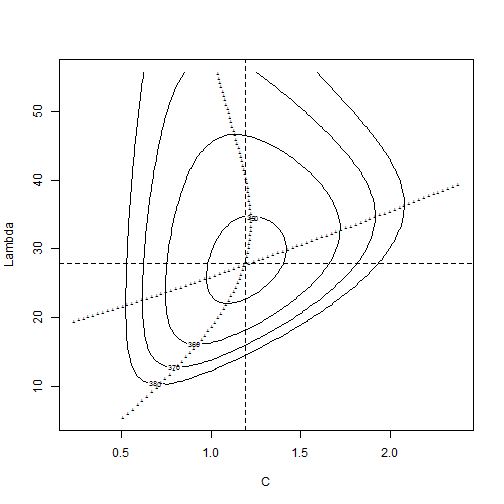 
                                                                                                                                                                                                                                                       
                                                                                                                                                                                                                                                       Now let's plot the likelihood profile for each variable


```r
                                                                                                                                                                                                                                                                               c.seq = c_mle*rp
lambda.seq = lam_mle*rp
plot(c.seq,c.like,type='l',xlab="C",ylab="Likelihood")
```

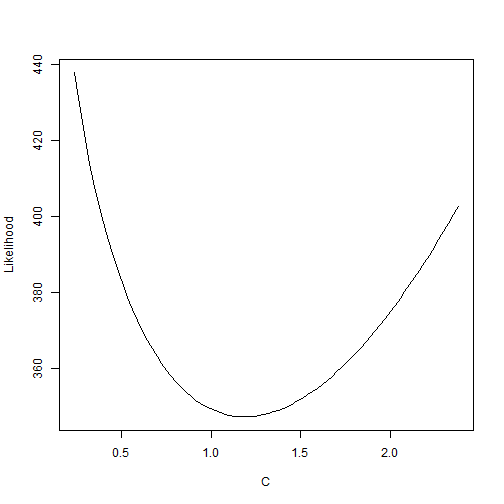 

```r
plot(lambda.seq,lambda.like,type='l',xlab="Lambda",ylab="Likelihood")
```

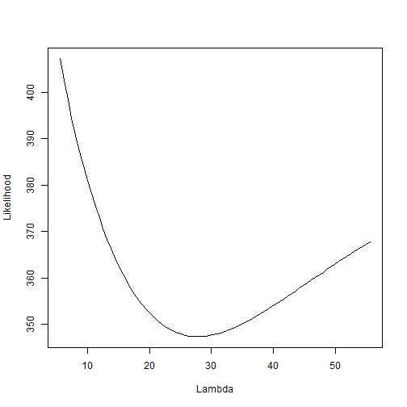 
                                                                                                                                                                                                                                                                               
                                                                                                                                                                                                                                                                               In order to find the CI from the likelihood profiles we'll need to know the threshold deviance from the chi-square test and some way of finding which values in our vectors correspond to those values.  Recall that "out" is the output from the optimization we performed in Lab 3 and that out$value is the negative  log likelihood.


```r
Dtest = qchisq(0.95,1)  	## Deviance for 95% CI
Dthresh = 2*out$value + Dtest	## Deviance threshold value
findThresh <- function(vec,Thr){	## find indices where vector crosses Thr
  which(as.logical(diff(sign(vec-Thr))))		
}
```
                                                                                                                                                                                                                                                                             **Lab Report Task 6**
                                                                                                                                                                                                                                                                                 Modify the previous section of code to calculate the CI for lambda as well. Turn in the likelihood profile plots with the CI and threshold for both variables and report the numeric values for the MLE and CI for both parameters


```r
c.CI = c.seq[findThresh(c.like,Dthresh/2)]
plot(c.seq,c.like,type='l',xlab="C",ylab="Likelihood")
abline(h=Dthresh/2)            ## deviance is divided by 2 to convert to neg log likelihood
abline(v=c.CI)
```

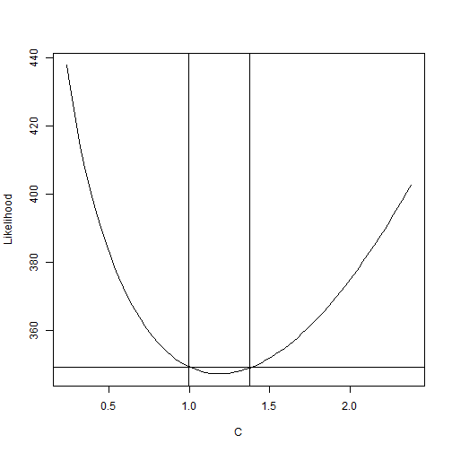 

```r
lambda.CI = lambda.seq[findThresh(lambda.like,Dthresh/2)]
plot(lambda.seq,lambda.like,type='l',xlab="lambda",ylab="Likelihood")
abline(h=Dthresh/2)            ## deviance is divided by 2 to convert to neg log likelihood
abline(v=lambda.CI)
```

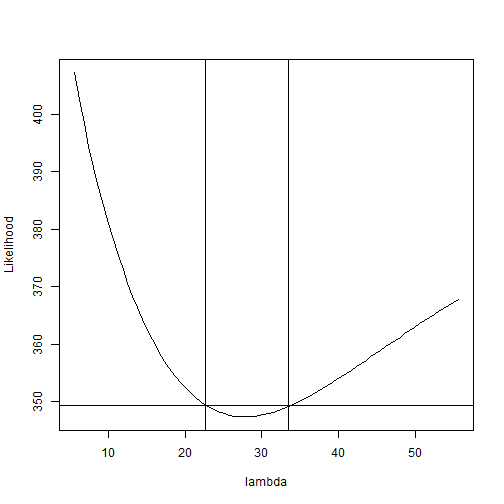 

```r
estimates <- data.frame(rbind(c(MLE = c_mle, c.CI), c(MLE = lam_mle, lambda.CI)))
names(estimates)[2:3] <- c("2.5%","97.5%")
row.names(estimates)<- NULL
estimates <- cbind(Var=c("c","lambda"),estimates)

estimates
```

```
##      Var    MLE    2.5%  97.5%
## 1      c  1.189  0.9963  1.376
## 2 lambda 27.801 22.6631 33.432
```
                    
