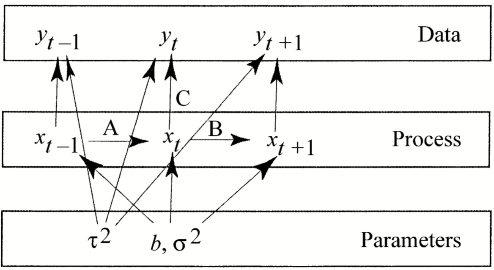

 
The objective of this lab is to explore state-space time-series models.  State-space models are a flexible framework that treats the true time-series as a latent variable, which separates the process model (which describes the transition from one time to the next) and the data model (which describes the observation error).  This separation allows us to treat the observed data for each time as conditionally independent from every other observation given the underlying latent state variable.  This separation also allows us to model the data and process on different time scales and to easily accommodate missing data or irregular sampling, which is difficult in traditional time-series models.  The basic state-space framework presented here is easily extensible to multiple data sets, multiple interacting time series, and more complex (e.g. multivariate) process models.

##Case Study:  Bialowieza moose

In this lab we will be working with data on the observed density of moose (Alces alces) in the Bialowieza Primeval Forest, which straddles the border of Poland and Belarus (Jedrzejewska et al 1997).  Our data consists of annual censuses collected by a combination of snow tracking, hunting, drive censuses, and counts at baiting sites.  Data have been corrected for known biases but some amount of observation error likely remains.  The data set is fairly long by ecological standards—a 48-year data set spanning 1946-1993—however, there are gaps of missing data from 1963-1966 and in 1989.  Data are available in the text file “alcesdata.txt”.  For further information, this analysis closely mirrors the example from Clark and Bjornstad (2004).

In this lab we will confront this data with the two simplest discrete-time population models in biology, exponential growth and logistic growth.  By comparing these two models we will be able to determine whether the growth of this population is density-dependent or density-independent.  We will also be able to estimate the intrinsic rate of population growth and the carrying capacity for the species, both of which are important for management and for understanding the basic biology of the species.  Finally, we will be able to partition the variability in the time-series into observation error vs. process error, which in this case is the inter-annual variability in population growth.  Knowing the inter-annual variability in population growth helps us understand to what extent population dynamics are driven by internal biological factors (autogenic) vs. external environmental factors (exogenous).  While we cannot attribute all of the residual process variance to exogenous factors because there are always biotic interactions that are not accounted for, a large amount of process error is often suggestive of environmental factors.

The two process models we will use for this lab are the discrete-time exponential growth model

$$N_{t+1} = N_t e^{r+\epsilon_t}$$

and the Ricker model, which is the discrete-time equivalent to logistic growth
 
$$N_{t+1} = N_t e^{r (1 - N_t / K) + \epsilon_t}$$

In both models, $N_t$ is the population density at time t, and r is the population growth rate (per-capita in/decrease in population from time t to time t+1).  In the second model, $K$ is the carrying capacity of the habitat (the maximum sustainable population size).  Finally, for both models we will assume that the process error, $\epsilon_t$, is normally distributed and multiplicative:

$$\epsilon_t \sim N(0,\sigma^2)$$
 
If we take the log of both sides and express the process model in terms of $X = ln(N)$, the two models then become:

$X_{t+1} = X_t + r + \epsilon_t$ Exponential

$X_{t+1} = X_t + r(1-N_t/K) + \epsilon_t$ Ricker

Next, lets assume that the observation error on the population densities is lognormally distributed.  This is a sensible choice because we know that the observed population density is bound at 0 (we can't have negative densities), and can reasonably expect the absolute error to increase with population density.  If we define $Y = ln(observed density)$ then this is equivalent to saying that Y has Normal error with a mean of X:
 
$$Y_t \sim N(X_t,\tau^2)$$



Figure 1:  Graph representation of the state space model (priors not shown).  Under parameters, b represents the process model coefficients (r for the exponential, r and K for the Ricker), $\tau^2$ is the observation error, and $\sigma^2$ is the process error..  As defined above, X and Y are the latent “true” density and the observed values, respectively. The letters A, B, and C indicate the three terms that contribute to the posterior for Xt.  

Finally, we will want to specify priors for the model parameters:

$r \sim N(r_0,V_r)$ 			## prior in intrinsic growth rate

$K \sim LN(K_0,V_k)$ 		  ## prior on carrying capacity

$\tau^2 \sim IG(t1,t2)$   ## prior on PROCESS variance

$\sigma^2 \sim IG(s1,s2)$ 		## prior on Observation error

$X_1 \sim N(\mu_0,V_0)$ 	## prior on initial time point

The implementation of this model in BUGS is fairly straightforward, and thus the specification of the data model (observation error) and the priors are left to you.  The process model is not complex either:

```
 ### Process model for exponential growth
  for(i in 2:N) {
    u[i] <- x[i-1] + r
    x[i] ~ dnorm(u[i],sigma)
  }
```


In this code you will notice a few things that differ slightly from models you've implemented in the past.  First is that there is error, $\sigma$, in the process model itself. This part is more familiar if you realize the model could easily be rewritten as having a random effect on r.  Second is that in the process model, the calculation of the X for the current time step depends upon the previous time step, which occurs because our process model describes the change in the state from one time step to the next.  Because of this you will note that there is one “trick” to the state-space model that has to do with the indexing of the variables.  While there are n datapoints, and thus up to n comparisons between the latent X and the observations Y, there are only n-1 transitions between time steps.  This means that the process model only shows up n-1 times (and thus is indexed from 2 to N instead of 1 to N), while the data model shows up n times.  If we had looped starting from 1 this would have caused a reference to X[0], which doesn't exist.  You'll also note that in the list of priors we put a prior on this first time point, X[1], which falls outside the process model loop.

Another thing that is different in this lab from what you have done before is the presence of NA values in the data.  The NA character is used to indicate missing data, and both R and BUGS are capable of handling this. You do not need to remove the NA values when exporting the data to BUGS, nor do you want to.  Since these values are missing from the observation model linking the latent variable, X, to the observation, Y, BUGS will automatically generate predictive estimates for them.  If you specify Y as one of your tracked variables you'll find that BUGS only generates posteriors for the 5 time points that are missing.

Finally, unlike many of your previous labs that converge quickly and are insensitive to the choice of prior and initial conditions, you will want to give thought to both the priors and initial conditions on parameters and state variables in this lab otherwise your chains may not converge over any reasonable timescale.  Also remember that initial conditions can (and in many cases should) be chosen based on the data, but priors can't just be 'tuned' to give the 'right' answer (i.e. clamping down on a prior without reference to external information is not the correct way to solve convergence problems).
 
## Lab Report Tasks

Lab Report Task 1
1.  Write out and run the BUGS code for the exponential growth model.  Include the BUGS code in your lab report.


```{r}
library(BRugs)
library(R2WinBUGS)
library(ggplot2)
library(reshape)

# Data read and shaping
alces <- read.table("data/alcesdata.txt", header=T)
data <- list()
data$y <- log(alces$density)
data$N <- length(alces$density)


# Bugs Model
FitExp <- function(){
  r ~ dnorm(0,25)  # r is mean zero w/ sd = 0.2
  sinv ~ dgamma(0.01, 0.01)
  tinv ~ dgamma(0.01,0.01)
  sigma <- 1/sinv
  tau   <- 1/tinv
  x[1] ~ dnorm(2, 1)
  # Process model
  for(i in 2:N) {
    u[i] <- x[i-1] + r
    x[i] ~ dnorm(u[i],sinv)
  }
  # Data model
  for(i in 1:N){
    y[i] ~ dnorm(x[i], tinv)    
  }
  # Simulation:
  for(i in 1:N){
    Px[i] ~ dnorm(x[i],tinv)
  }
}

write.model(model = FitExp, con = "FitExp.txt")

init.cond1 <- function(){
  ## starts each chain from the same initial conditions
  list(sinv=25, tinv=25,r=0.1, x=2*0.1*seq(1:48))
}

b1 = openbugs(data=data,  ## data passed to the model
  init=init.cond1,    ## initial conditions, NULL is equivalent to “gen inits”
  model.file="FitExp.txt",  ## file name of our BUGS file 
  n.chains=3,		## number of MCMC chains
	n.iter=3500,		## length of each chain
	n.burnin=100,		## burn in to exclude
	n.thin = 2,		## thin
	parameters.to.save=c("x","Px","sigma", "tau","r")  ## parameters we want to track
)

quants1 <- apply(b1$sims.matrix,2, quantile, c(0.025, 0.5, 0.975))
quants1

```
Also include the following plots:


a) Plots of the time series data on both the LOG and LINEAR scales that include the model mean and credible intervals.
```{r}
plot(1946:1993,exp(data$y), ylim=c(min(exp(quants1[,1:48])),max(exp(quants1[,1:48]))), main="Exp Fit", xlab = "Year",ylab="Population")
lines(1946:1993, exp(quants1[2,1:48]), col=3) # median
lines(1946:1993, exp(quants1[1,1:48]), col=3, lty=2) # CI
lines(1946:1993, exp(quants1[3,1:48]), col=3, lty=2) # CI

plot(1946:1993,data$y, ylim=c(min(quants1[,1:48]),max(quants1[,1:48])), main="Exp Fit", xlab = "Year",ylab="Log Population")
lines(1946:1993, quants1[2,1:48], col=3) # median
lines(1946:1993, quants1[1,1:48], col=3, lty=2) # CI
lines(1946:1993, quants1[3,1:48], col=3, lty=2) # CI
```

b) Density plots for the predicted values for the missing data
```{r}

dens1 <- apply(b1$sims.matrix, 2, density)

index <- which(is.na(data$y))
x_index <- paste("x[",index,"]",sep="")
for(x_ind in x_index){
  plot(dens1[[x_ind]],main=paste(x_ind, "log scale"))
}

wide <- melt(b1$sims.matrix[,x_index])
ggplot(wide, aes(y=value, x=factor(X2))) + geom_boxplot(outlier.shape=NA) + theme_bw() + xlab("missing ob") + ylab("log-population")

```

c) Density plots of the intrinsic growth rate, the observation error variance, and the process model error variance
```{r}
for(lab in c("r","sigma","tau")){
  plot(dens1[[lab]],main=lab)
}
```
Note: $\tau$ and $\sigma$ represent variances here where traditionally variances are represented as $\sigma^2$ or $\tau^2$.

2.	Modify the exponential growth process model in the BUGS code to instead be the Ricker growth model.  Rerun including your BUGS code and the same figures as in part 1 plus plots for both the prior and posterior density on the carrying capacity.

```{r}
# Bugs Model
FitRicker <- function(){
  r ~ dnorm(0,25)  # r is mean zero w/ sd = 0.2
  sinv ~ dgamma(0.01, 0.01)
  tinv ~ dgamma(0.01,0.01)
  k ~ dlnorm(0,0.01)
  sigma <- 1/sinv
  tau   <- 1/tinv
  x[1] ~ dnorm(2, 1)
  # Process model
  for(i in 2:N) {
    u[i] <- x[i-1] + r*(1-exp(y[i-1])/k)
    x[i] ~ dnorm(u[i],sinv)
  }
  # Data model
  for(i in 1:N){
    y[i] ~ dnorm(x[i], tinv)    
  }
  # Simulation:
  for(i in 1:N){
    Px[i] ~ dnorm(x[i],tinv)
  }
}

write.model(model = FitRicker, con = "FitRicker.txt")

init.cond2 <- function(){
  ## starts each chain from the same initial conditions
  list(sinv=25, tinv=25,r=0.13, x=0.13*seq(1:48), k=5)
}

b2 = openbugs(data=data,  ## data passed to the model
  init=init.cond2,    ## initial conditions, NULL is equivalent to “gen inits”
  model.file="FitRicker.txt",  ## file name of our BUGS file 
  n.chains=3,  	## number of MCMC chains
	n.iter=3500,		## length of each chain
	n.burnin=100,		## burn in to exclude
	n.thin = 2,		## thin
	parameters.to.save=c("x","Px","sigma", "tau","r","k")  ## parameters we want to track
)

quants2 <- apply(b2$sims.matrix,2, quantile, c(0.025, 0.5, 0.975))
quants2

plot(1946:1993,exp(data$y), ylim=c(min(exp(quants2[,1:48])),max(exp(quants2[,1:48]))), main="Ricker Fit", xlab = "Year",ylab="Population")
lines(1946:1993, exp(quants2[2,1:48]), col=3) # median
lines(1946:1993, exp(quants2[1,1:48]), col=3, lty=2) # CI
lines(1946:1993, exp(quants2[3,1:48]), col=3, lty=2) # CI

plot(1946:1993,data$y, ylim=c(min(quants2[,1:48]),max(quants2[,1:48])), main="Ricker Fit", xlab = "Year",ylab="Log Population")
lines(1946:1993, quants2[2,1:48], col=3) # median
lines(1946:1993, quants2[1,1:48], col=3, lty=2) # CI
lines(1946:1993, quants2[3,1:48], col=3, lty=2) # CI


prior_k <- density(rnorm(5000, mean = 0,sd = 1/sqrt(0.01)))
posterior_k <- density(log(b2$sims.matrix[,"k"]))

plot(prior_k, col=2, ylim=c(0.0,0.8), xlim=c(-30,30), main="K")
lines(posterior_k, col=3)
median_logk = round(log(quants2[2,"k"]),3)
abline(v = median_logk, lty=2)
legend("topleft", legend = c("Prior", "Posterior",paste("Median log(k) =", median_logk)), col=c(2,3,1),lty = c(1,1,2))

dens2 <- apply(b2$sims.matrix, 2, density)

for(x_ind in x_index){
  plot(dens2[[x_ind]],main=paste(x_ind, "log scale"))
}

wide <- melt(b2$sims.matrix[,x_index])
ggplot(wide, aes(y=value, x=factor(X2))) + geom_boxplot(outlier.shape=NA) + theme_bw() + xlab("missing ob") + ylab("log-population")

# Density plots of the intrinsic growth rate, the observation error variance, and the process model error variance
for(lab in c("r","sigma","tau")){
  plot(dens2[[lab]],main=lab)
}
```

3.	Construct a summary table that includes the parameters in both models, their 95% CI, and the model DIC scores.

```{r}
cols <- c(1, 3,5,7) # mean, 2.5%, 50%, 97.5%
b1_vars<-c("sigma","tau", "r", "deviance")
b2_vars<-c("sigma","tau", "r", "k","deviance")

results <- rbind(cbind.data.frame(model="b1", var=b1_vars, b1$summary[b1_vars,cols]), cbind.data.frame(model="b2", var=b2_vars, b2$summary[b2_vars,cols]))
rownames(results) <- NULL
results

data.frame(model = c(paste0("b",1:2)),DIC = c(b1$DIC, b2$DIC))
```

Note: $\tau$ and $\sigma$ are variances. Carrying capacity k is in the log-space.

4.	Briefly give an interpretation of your results.  Be sure to comment on which model is a better fit, what you can interpret about the importance of density dependence in regulating this population, and whether the population is at its carrying capacity.  

The DIC for the exponential fit is much lower, indicating that the exponential fit is the more parsimonious of the two. The Ricker model indicates a carrying capacity of `r round(b2$median$k)`. Visually the plot appears to confirm this, but strictly speaking, k should probably not be considered significant in light of the DICs. It should be noted that by adding a little bit of noise to an exponential process, pseudodata will lead to many regressions which the Ricker model will indicate a k that is *just barely in the tail* of the series. That is k=`r round(b2$median$k)` is awfully close to the max of the series, and in the event of a true process which is exponential, that is what we would expect in the regression.

Here we should use the DIC and discard any meaning for k.

5.	What can you infer about the relative importance of autogenic vs exogenous factors in regulating this population?

Presence of an autogenic factor can be determined, r. Presence of an exogenous factor such as carrying capacity is ambiguous. There are factors external to the data leading us to believe carry capacity exists, but it cannot be determined from this data.

6.	**Extra Credit**: An alternative to fitting this model as a time-series would have been to fit the data to the general solution for the model (e.g. for the exponential growth model, this would have been $N[1]*exp[r*t]$  ), which would have ignored the process varibility.  To approximate the difference in the resulting prediction, generate a plot for the best fitting model (Exponential or Ricker) that contains both (1) the posterior mean model from your Bayesian fit, and (2) the prediction from the process model using the posterior mean of the parameters and ignoring process error.  Comment on the difference between these two lines.

```{r}
FitExpBasic <- function(){
  r ~ dnorm(0,25)  # r is mean zero w/ sd = 0.2
  tinv ~ dgamma(0.01,0.01)
  tau   <- 1/tinv
  x[1] ~ dnorm(2, 1)
  # Process model
  for(i in 2:N) {      
    x[i] <- x[i-1]+r
  }
  # Data model
  for(i in 1:N){
    y[i] ~ dnorm(x[i], tinv)    
  }
  # Simulation:
  for(i in 1:N){
    Px[i] ~ dnorm(x[i],tinv)
  }
}

write.model(model = FitExpBasic, con = "FitExpBasic.txt")

init.cond3 <- function(){
  ## starts each chain from the same initial conditions
  list(tinv=25,r=0.1, x=2*0.1*seq(1:48))
}

b3 = openbugs(data=data,  ## data passed to the model
  init=init.cond3,    ## initial conditions, NULL is equivalent to “gen inits”
  model.file="FitExpBasic.txt",  ## file name of our BUGS file 
  n.chains=3,  	## number of MCMC chains
	n.iter=3500,		## length of each chain
	n.burnin=100,		## burn in to exclude
	n.thin = 2,		## thin
	parameters.to.save=c("x","Px","tau","r")  ## parameters we want to track
)

quants3 <- apply(b3$sims.matrix,2, quantile, c(0.025, 0.5, 0.975))
quants3

plot(1946:1993,exp(data$y), ylim=c(min(exp(quants3[,1:48])),max(exp(quants3[,1:48]))), main="Exp Fit", xlab = "Year",ylab="Population")
lines(1946:1993, exp(quants3[2,1:48]), col=3) # median
lines(1946:1993, exp(quants3[1,1:48]), col=3, lty=2) # CI
lines(1946:1993, exp(quants3[3,1:48]), col=3, lty=2) # CI

lines(1946:1993, exp(quants1[2,"x[1]"])*exp(quants1[2,"r"]*(0:47)), col=2) # median

lines(1946:1993, exp(quants1[2,1:48]), col=4) # median
lines(1946:1993, exp(quants1[1,1:48]), col=4, lty=2) # CI
lines(1946:1993, exp(quants1[3,1:48]), col=4, lty=2) # CI

legend("topleft", legend=c("Exp w/no proc err", "Exp w/proc err. Proc err not simulated.","Exp w/proc err"), col=c(3,2, 4), lty=c(1,1,1))

```

The major difference when the process error is removed from the projection (blue curve to red curve) is that the initial points now significantly weight down the red curve. The process error is what keeps the blue curve on the data.

The green curve, or the exponential w/process error actually fit to the data, has a different starting point, over a factor of 10 higher. That's what accounts for the primary difference between the green and red curves (despite having practically the same r,  rgreen = `r b3$mean$r`,  rred = rblue = `r b1$mean$r`). The red and the green curves could be made to nearly overlap, provided an appropriate choice of x[1].

Just offhand I can set x[1] to the mean of x[1] in b3.

```{r}
plot(1946:1993,exp(data$y), ylim=c(min(exp(quants3[,1:48])),max(exp(quants3[,1:48]))), main="Exp Fit", xlab = "Year",ylab="Population")
lines(1946:1993, exp(quants3[2,1:48]), col=3) # median
lines(1946:1993, exp(quants3[1,1:48]), col=3, lty=2) # CI
lines(1946:1993, exp(quants3[3,1:48]), col=3, lty=2) # CI

lines(1946:1993, exp(quants3[2,"x[1]"])*exp(quants1[2,"r"]*(0:47)), col=2) # median
legend("topleft", legend=c("Exp w/no proc err", "Exp w/proc err. Proc err not simulated. Choice x[1]"), col=c(3,2, 4), lty=c(1,1,1))
```